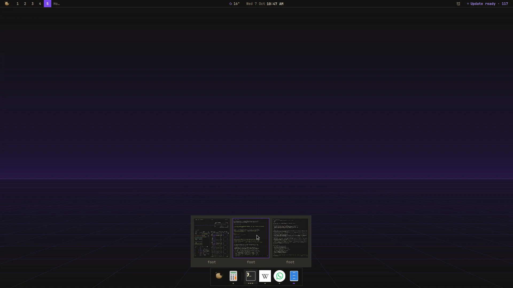

# Dock

A plugin for [Mazapan](https://mazapan.dev), listed in its [plugin registry](https://mazapan.dev/plugins/dock/).



Your apps at the bottom of the screen: the ones you keep there, then a
hairline, then every other app with a window open, in the order they showed
up. It takes its colors, corners and motion from the theme.

- **A mark for each window** under an app's icon, up to three; the accent
  while one of them has the focus.
- **The window found, wherever it is.** A click on an app with one window
  goes to it: its workspace, and on the strip of columns, its column, even
  when it was off the screen.
- **Every window of an app, live.** An app with several windows shows
  them side by side above its icon, each with its title: a click goes to
  one, a middle click closes it. The mouse wheel over the icon goes through
  them one after the other.
- **Its menu** (a right click): the app's own actions (a private window, a
  new document), a new window, keep it in the dock or take it out, close
  its windows.
- **Out of the way**, as you choose: always there with windows leaving it
  room; only while a window would sit under it (the default); or until the
  pointer reaches the bottom edge. Away, the bottom edge brings it back.
- **Web apps as apps**: each web app (the `webapps` plugin) has its own
  icon, not the browser's.
- **The palette** a click away, on the Mazapan button at its start.

A click on an app without windows opens it; a middle click opens another
window (with the app's own *new window* when it has one: Files and Text
Editor run once and only raise their window when started again).

`SUPER + D` shows or hides it; in the palette, "Dock". Each screen has its
own, with that screen's windows.

Apps kept in the dock are a setting, `pinned`, like any other: in
`~/.config/mazapan/config.toml`, so they go with it to another machine, and
`mazapan undo` takes a change back. The order of the other apps is kept in
`~/.local/state/mazapan/dock.json`, so a reload of the shell (a theme
change) doesn't shuffle them.

## What it reaches and why

- **Nothing outside this computer.** It never goes to the network.
- **Your windows**, through Hyprland: which app each one is, its title,
  where it is, to draw the dock and to get out of their way. The previews
  of an app's windows are live captures of them, taken only while they're
  out and dropped when they close.
- **What it runs**: an app you open, through the palette's launcher
  (`palette-launch`, which says so when one doesn't start); `webapp list`
  (plugin webapps), to tell web apps apart; `mazapan apply --set
  dock.pinned=…` when you keep an app in the dock or take it out; the
  palette, from its button.
- **What it keeps**: `~/.local/state/mazapan/dock.json`, the order the
  apps showed up in.
- **Files it writes**: its part of the shell (`components/dock/`, the
  panel that holds a dock for each screen), its key in Hyprland, and its
  settings, read as they change.

## Install

In Mazapan, the Plugins panel (`SUPER + SHIFT + P`) lists it under the
community's: its page shows what it can do before you install it. Or:

```sh
mazapan plugins add dock
mazapan apply
```

Updates come through the registry: `mazapan plugins update dock`, or the
Updates panel, asking again only for anything new it would be able to do.

## Develop

```sh
git clone https://github.com/rick-dev-creator/mazapan-dock
mazapan plugins dev mazapan-dock     # applied again on every save
mazapan plugins check mazapan-dock   # every theme, every language, before a release
node --test mazapan-dock/tests/      # what the dock decides (Apps.js.tmpl)
```

What the dock decides (which app a window belongs to, the order, which
window comes next, whether a window covers it) is plain JavaScript in
`Apps.js.tmpl`, with its tests; the QML files join it to the shell:
`DockService` (the state, one for every screen), `DockWindow` (a screen's
dock), `DockButton` (an app), `WindowPicker` and `AppMenu`.

A release is a tag, `vX.Y.Z`, the same as `version` in plugin.toml; the
registry lists it once it passes its checks.

## License

MIT
